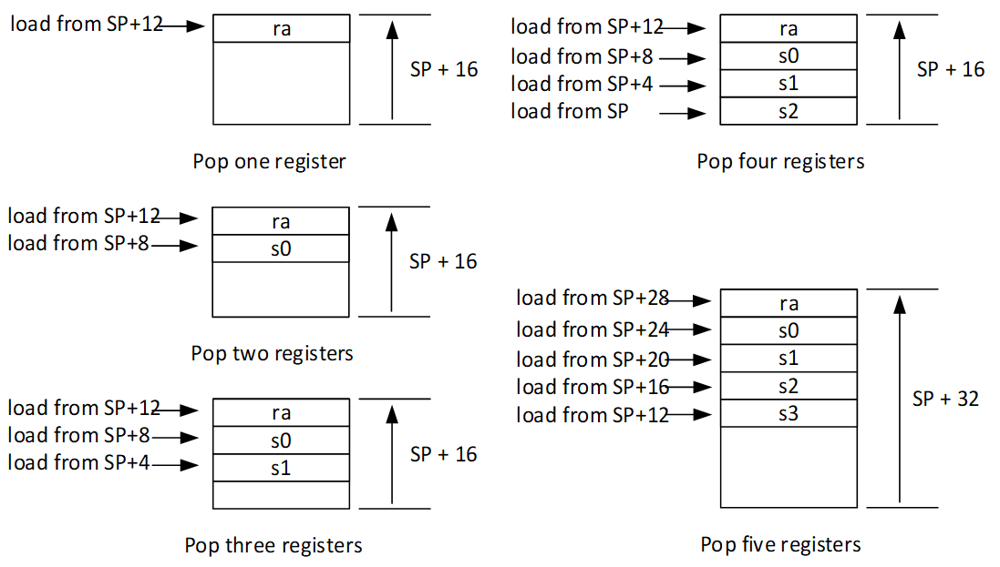

RISC-V 16-bit Push/Pop Extension
================================

These instructions are included in the Huawei custom RISCV extension, and are implemented on silicon.

Warning: These instructions support RV32 UABI only. The updated proposal supporting all configurations is `here <https://github.com/riscv/riscv-code-size-reduction/blob/master/ISA%20proposals/Huawei/riscv_push_pop_extension_RV32_RV64.adoc>`_ 

Rationale
---------

``C.PUSH/C.POP/C.POPRET`` are designed to replace the most commonly called functions generated by the compiler using *–m-save-restore*. 
When the *–msave-restore* option is used the compiler replaces the sequence of stores plus *sp* decrement operation required to 
spill/push registers to the stack with a call to a shared co-routine that performs this operation. In addition the equivalent fill/pop 
sequence is replaced with a jump to a shared co-routine (which then performs the return to the caller of the function). The code savings 
can be significant (provided that the co-routine jump/calls can be encoded in a single 32-bit instruction) but the run-time overhead is 
high as an additional 3 jumps are required for each push/pop sequence; in addition the shared save/restore routines include redundant 
memory instructions when the number of registers to spill is not a multiple of 4.

This proposal is for three 16-bit encodings:
 
 - ``C.PUSH`` instruction which allows most spill sequences to only take 16-bits of code space instead of 32-bits 
   for the call to the save routine (or in some cases 64-bits if the target function is too far away).
 - ``C.POP`` instruction which allows most fill sequences to be performed with two 16-bit instructions (C.POP+RET) 
   which matches the cost of the co-routine jump (for jumps <1Mbyte) but with significantly better performance.
 - ``C.POPRET`` which allows both the ``C.POP`` and RET to be performed in a single instruction saving 16-bits of code 
   with respect to a C.POP+RET or a jump to a restore co-routine.  

All three include an additional stack pointer adjustment to save an extra 16-bits.

``C.PUSH/C.POP/C.POPRET`` are implemented in the RISC-V HCC toolchain, this is the internal Huawei branch of GCC including the Huawei custom instructions

- enabled with *–mpush-pop*, and *-Os* must be specified for them to be inferred
- saves 7.7% of Huawei IoT code size relative to compiling without *-msave-restore*
- saves 3.5% of Huawei IoT code size relative to compiling with *-msave-restore*

Opcode Assignment
-----------------

.. table:: ``C.PUSH/C.POP/C.POPRET`` 16-bit instruction encoding

  +----+----+----+----+----+----+---+---+---+---+---+---+---+---+---+---+-----------+
  | 15 | 14 | 13 | 12 | 11 | 10 | 9 | 8 | 7 | 6 | 5 | 4 | 3 | 2 | 1 | 0 |    name   |
  +----+----+----+----+----+----+---+---+---+---+---+---+---+---+---+---+-----------+
  |  1 |  0 |  0 |  sp16imm             | rcount        | 0 | 0 | 0 | 0 |  C.POP    |
  +----+----+----+----+----+----+---+---+--+---+----+---+---+---+---+---+-----------+
  |  1 |  0 |  0 |  sp16imm             | rcount        | 0 | 1 | 0 | 0 |  C.POPRET |
  +----+----+----+----+----+----+---+---+--+---+----+---+---+---+---+---+-----------+
  |  1 |  0 |  0 |  sp16imm             | rcount        | 1 | 0 | 0 | 0 |  C.PUSH   |
  +----+----+----+----+----+----+---+---+--+---+----+---+---+---+---+---+-----------+

Note that [15:13] and [1:0] identify the encoding within the 16-bit encoding space. [3:2] is the ``opcode`` field.

The encoding contains no explicit register index fields as the memory accesses and pointer increments are all based on the stack pointer register as 
defined in the standard RISC-V ABI (x2) and the registers to be loaded/stored are specified using the ``rcount`` field. The set of registers supported 
is the callee save subset of the standard RISC-V UABI, as defined in Chapter 20 *RISC-V Assembly Programmer’s Handbook of the RISC-V Unprivileged ISA* specification 
(s0-s11), and the caller save registers which are most frequently spilled: the return address (ra) and first function arguments (a0-1).

The mask to register mapping is summarised below.

.. table:: Register count mapping for C.PUSH/C.POP/C.POPRET

  +--------+-----------------+---------------------------+
  | rcount | ABI names       |	Register numbers          |
  +--------+-----------------+---------------------------+
  | 0      | reserved        |  reserved                 |
  +--------+-----------------+---------------------------+
  | 1      | ra              |  x1                       |
  +--------+-----------------+---------------------------+
  | 2      |ra, s0           |x1, x8                     |
  +--------+-----------------+---------------------------+
  | 3      |ra, s0-s1        |x1, x8-x9                  |
  +--------+-----------------+---------------------------+
  | 4      |ra, s0-s2        |x1, x8-x9, x18             |
  +--------+-----------------+---------------------------+
  | 5      |ra, s0-s3        |x1, x8-x9, x18-x19         |
  +--------+-----------------+---------------------------+
  | 6      |ra, s0-s4        |x1, x8-x9, x18-x20         |
  +--------+-----------------+---------------------------+
  | 7      |ra, s0-s5        |x1, x8-x9, x18-x21         |
  +--------+-----------------+---------------------------+
  | 8      |ra, s0-s6        |x1, x8-x9, x18-x22         |
  +--------+-----------------+---------------------------+
  | 9      |ra, s0-s7        |x1, x8-x9, x18-x23         |
  +--------+-----------------+---------------------------+
  | 10     |ra, s0-s8        |x1, x8-x9, x18-x24         |
  +--------+-----------------+---------------------------+
  | 11     |ra, s0-s9        |x1, x8-x9, x18-x25         |
  +--------+-----------------+---------------------------+
  | 12     |ra, s0-s10       |x1, x8-x9, x18-x26         |
  +--------+-----------------+---------------------------+
  | 13     |ra, s0-s11       |x1, x8-x9, x18-x27         |
  +--------+-----------------+---------------------------+
  | 14     |ra, s0-s11, a0   |x1, x8-x9, x18-x27, x10    |
  +--------+-----------------+---------------------------+
  | 15     |ra, s0-s11, a0-a1|x1, x8-x9, x18-x27, x10-x11|
  +--------+-----------------+---------------------------+

The ``opcode`` field (bits [3:2]) indicates whether a ``C.POP`` instruction or a ``C.POPRET`` instruction is to be performed, and whether a ``C.POP``
should also include a final ``RET``. The ``sp16imm`` field (bits [12:8]) is an unsigned 5-bit immediate that indicates the number of 
additional 16-byte blocks to adjust the stack pointer by. The purpose of this field is to allow a function to allocate additional 
space on the stack for automatic variables without having to perform an additional stack adjustment (and therefore save more code size).

The total number of each instruction in the IoT code is below (to get an idea of how well used they are). The code base has 9529 functions, 
some are from hand-coded libraries which do not make use of the ``C.PUSH/C.POP/C.POPRET`` instructions, or small leaf functions which do not require 
stack maintenance

============= ===========
instruction   count
============= ===========
PUSH          6924
POP           2175
POPRET        5948
============= ===========

``C.PUSH`` is not currently inferred if the function takes varargs, or if the stack pointer adjustment is out of range for the encoding.
Both of these are HCC limitations (in my opinion). ``C.POP/C.POPRET`` is inferred in both of these cases which explains the imbalance.

Range of ``sp16imm`` values, clearly 2-bits are enough to save encoding space if required

============= ===================
percentage    value of sp16imm
============= ===================
61.1%         0
24.2%         1
7.0%          2
3.4%          3
1.5%          4
1.0%          5
0.5%          6
0.3%          7
0.3%          8
0.2%          13
0.1%          15
0.1%          9
0.1%          14
0.1%          10
0.1%          12
0.1%          11
============= ===================

``rcount values`` - 0, 14 and 15 could be allocated to do useful work, e.g. save/restore all caller save registers for interrupt handlers
If encoding space is limited a 2-bit rcount field covers 70.0% of cases, or a 3-bit field covers 92.8% of cases.

============= =========================
percentage    value of rcount
============= =========================
25.6%         2
16.6%         1
16.0%         3
11.8%         4
8.9%          5
6.0%          6
4.8%          7
3.1%          8
2.3%          13
2.0%          9
1.3%          10
0.9%          11
0.7%          12
unused        14
unused        15
illegal       0
============= =========================

``C.PUSH`` instruction
--------------------

A ``C.PUSH`` instruction writes to memory the set of registers selected by *rcount*, the registers are written to the memory immediately 
below the current stack pointer.  The writes start at the lowest memory location to be written by the C.PUSH, sp-4*N, where N is the 
number registers to store (*rcount*).  The selected registers are written to contiguous incrementing 4-byte words starting with the 
register in the reverse of the order shown in Table 2 above (ra is always stored last).

Once all writes have completed the stack pointer register is decremented by 16*(((N+3)/4)+``sp16imm``). The ``sp16imm`` is a 5-bit field 
that allows up to an additional 496 bytes of stack to be allocated for automatic variables without having to issue additional stack 
manipulation instructions. Note that the subexpression *((N+3)/4)* is the number of 16 byte blocks needed to hold the spilled registers, 
1 for values of N up to 4, 2 for values of N in the range 5 to 8 and so on.

.. figure:: push_1to5_regs_170pc_zoom.png
  
  push 1 to 5 registers, stores can happen in any order, note 3 register holes in the stack pointer decrement

``C.POP/C.POPRET`` instruction
----------------------------

A ``C.POP`` instruction loads the set of registers selected by *rcount* from the memory. The loads start at the lowest memory location to be read 
by the ``C.POP``, *sp+4*(4*sp16imm+3-((N+3) mod 4))*, where N is the number registers to load (*rcount*). Note that the subexpression *3-((N+3) mod 4)* 
is the number of register “holes” to skip before reading from the stack (once the adjustment for the additional space has been done), 
for example, if N=8 it is 0 but if N=1 it is 3. 

The selected registers are loaded from contiguous incrementing 4-byte words in the reverse of the order shown in the table above (ra is always loaded last).

Once all loads have completed the stack pointer register (sp) is incremented by 16*(((N+3)/4)+sp16imm), placing it immediately above 
the block of memory read by the ``C.POP`` instruction. 

For ``C.POPRET``, a RET is executed as the final step in the sequence

  pop 1 to 5 registers, loads can happen in any order, note 3 register holes in the stack pointer increment

Exceptions and Interrupts
-------------------------

If sp(x2) is not 16 byte aligned when a ``C.PUSH/C.POP/C.POPRET`` instruction is executed a memory alignment exception will be generated 
(mcause=6 for ``C.PUSH``, mcause=4 for ``C.POP/C.POPRET``).

If *rcount* is 0 then an illegal instruction exception will be generated (mcause=2).

If an interrupt occurs during a ``C.PUSH/C.POP/C.POPRET`` instruction a number of implementation options are possible:

1. The ``C.PUSH/C.POP/C.POPRET`` instructions can be made non-interruptible, this makes them safe to use in access sensitive memory regions 
   (for example memory-mapped FIFOs) but risks making the worst case interrupt latency high.
2. The ``C.PUSH/C.POP/C.POPRET`` instructions can be aborted, this will leave only a subset of the memory locations/registers updated for 
   ``C.PUSH/C.POP/C.POPRET`` respectively, and the stack pointer unmodified. 
3. An implementation could count the pending set of sub-instructions when the interrupt occurs and make it software visible. The handler 
   could then either emulate the outstanding instructions (and might be forced to if the aborted access was to a context sensitive device) 
   or restart the instruction from the beginning. 
4. As an extension of possibility (3), hardware could be implemented to restart the instruction based on the saved context. To support 
   the option to delay restarting the instruction until after a complete context switch has occurred (or to allow use of ``C.PUSH/C.POP/C.POPRET`` 
   in the handler code) it must be possible to both read and write the pending status of these instructions.

In 2 *the sequence cannot be interrupted between the stack pointer update and the RET for ``C.POPRET``*. When restarted the memory locations/registers 
already updated will be updated again and, if the instruction completes this time, the stack pointer is updated. This behavior is fine for normal memory 
but risks corruption of context sensitive devices. However, as these instructions are intended specifically for manipulating the stack this is unlikely to be an issue.

The best choice is highly dependent on the use-case for the core and is hence left implementation specific.

Assembler Syntax
----------------

The ``C.PUSH/C.POP/C.POPRET`` instructions are represented in assembler as the mnemonic followed by a braced and comma separated list of registers, 
followed by the total size of the stack adjustment expressed in bytes. The stack adjustment should include an appropriate sign bit and the space 
needed to accommodate the registers in the register list. Register ranges are also permitted and indicated using a hyphen (-). The register list 
may only contain registers supported by ``C.PUSH/C.POP/C.POPRET`` instructions but these can be listed in any order and use the ABI or x plus index 
register representation. 

To use the 16-bit encoding of ``C.PUSH/C.POP/C.POPRET`` then the registers specified in the encoding must match one of the sets of entries in in Table 2 
above. Otherwise the 32-bit encoding will be required (if implemented, if not then this will cause an assembler error). The 32-bit encoding is not specified 
in this document as it is not currently implemented.

To be legal the stack adjustment must:

1. Be negative for a ``C.PUSH`` and positive for a ``C.POP/C.POPRET``
2. Be a multiple of 16
3. Have a magnitude greater than or equal to 4 times the number of registers in the list
4. Have an absolute value that meets the constraint 16*(((N+3)/4)+M) where N is the number of registers and 0<=M<32.     

For any other value the assembler will generate an ‘illegal operands’ error.
 
Assembler Examples
------------------

``C.PUSH``
----------

.. code-block:: text

 push  {ra, s0-s4}, -64

Encoding: rcount=5,  sp16imm=2,  C.PUSH=1

Micro operation sequence: 

.. code-block:: text

  sw  s4, -24(sp); sw  s3, -20(sp);
  sw  s2, -16(sp); sw  s1, -12(sp);
  sw  s0, -8(sp);  sw  ra, -4(sp);
  addi sp, sp, -64;

``C.POP``
---------

.. code-block:: text

  pop   { x1, x8-x9, x18-x25}, 256

Encoding: rcount=11,  sp16imm=13,  C.PUSH=0

Micro operation sequence:

.. code-block:: text

  lw  x25, 212(sp);  lw  x24, 216(sp);
  lw  x23, 220(sp);  lw  x22, 224(sp)
  lw  x21, 228(sp);  lw  x20, 232(sp);
  lw  x19, 236(sp);  lw  x18, 240(sp)
  lw   x9, 244(sp);  lw   x8, 248(sp);
  lw   x1, 252(sp);
  addi sp, sp, 256

``C.POPRET``
------------

.. code-block:: text

  popret   { x1, x8-x9, x18-x19}, 32

Encoding: rcount=5,  sp16imm=0,  C.PUSH=0

Micro operation sequence:

.. code-block:: text

  lw  x19, 12(sp);  lw  x18, 16(sp);
  lw   x9, 20(sp);  lw   x8, 24(sp);
  lw   x1, 28(sp);
  addi sp, sp, 32; ret
